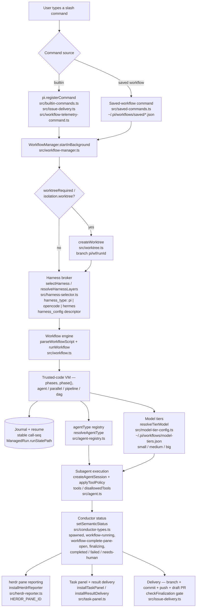

# pi-dynamic-workflows-oc-style

**Dynamic multi-agent workflows for [Pi](https://pi.dev).** Fan a task out across
hundreds of subagents with model routing, context governance, resume, and
git-worktree isolation. The runtime supports phases, fan-out (`parallel`/`pipeline`/`dag`),
model-tier routing, context modes, saved workflows, and the Issue Delivery
closed-loop workflow (Scout → Thinker → Worker → Checks → Verifier → PR).

> Independently maintained. Originally derived from [`@quintinshaw/pi-dynamic-workflows`](https://github.com/QuintinShaw/pi-dynamic-workflows) (MIT) and substantially extended; see [PROVENANCE.md](./PROVENANCE.md) for the relationship; the projects have since diverged and upstream is treated as a read-only idea source.

- **Security model:** workflow scripts are trusted code, not sandboxed; see [SECURITY.md](./SECURITY.md)
- **License:** MIT (see [LICENSE](./LICENSE))

---

## Quickstart

Point Pi's agent settings at this checkout, build, and restart Pi:

```jsonc
// ~/.pi/agent/settings.json
{ "packages": [ "/path/to/this/repo" ] }
```

```bash
npm run build     # tsc -> dist/
npm test          # full gate: biome check . && build && unit tests
# then restart pi
```

If you also install `@amaster.ai/pi-telemetry`, list this package before it in
Pi settings. `pi-dynamic-workflows-oc-style` ships an early
`extensions/telemetry-scrub.ts` package extension that clears stale inherited
`PI_TELEMETRY_*` values before telemetry snapshots `process.env`; loading
telemetry first is unsupported because the stale values are already captured.

Optional Langfuse workflow tracing is enabled when `LANGFUSE_PUBLIC_KEY` and
`LANGFUSE_SECRET_KEY` are present. It emits workflow traces plus compaction
policy spans from the runtime API (`emitCompactionTelemetry`) and the local
autocompactor JSONL bridge (`~/.autocompactor/pi/stats/events.jsonl`). Payloads
and absolute run paths stay redacted unless `LANGFUSE_INCLUDE_PAYLOADS=true`.
For tmux/supervisor-launched sessions, see
[Supervisor telemetry/env policy](./docs/supervisor-telemetry-env.md): never pass
a blank `HINDSIGHT_API_URL=`, load Langfuse secrets via a secret-managed env file,
and use the exported `prepareSupervisorTelemetryEnv()` helper for secret-safe
launch diagnostics.

---

## Slash commands

| Command | Usage | What it does |
|---------|-------|--------------|
| `/workflows` | `[list] \| status <id> \| watch <id> \| stop <id> \| pause <id> \| resume <id> \| rm <id> \| save <name> [runId]` | Manage runs. No args (with a UI) opens the interactive navigator. `watch` streams live progress to the status bar and prints the final snapshot. `save` registers a finished run as a reusable `/<name>` command. |
| `/code-review` | `[high\|xhigh\|max] [--mode <name>] [--harness-type <id>] [--harness-config <id>] [target]` | Multi-angle code review: scope → find (N angles) → verify → sweep → synthesize. All agents tagged `tier: "big"`. Used as an **in-session sanity checkpoint**, not a PR/merge gate. The first token is the effort level (`high` default; `xhigh`/`max` add a sweep phase) and is consumed before the target — so a target literally named `max` must be disambiguated. |
| `/deep-research` | `[--mode <name>] <question>` | Research a question across the web with cross-checked sources. |
| `/adversarial-review` | `[--mode <name>] [--evidence[=web_fetch,github\|web_search]] [--no-evidence] [--reviewers N] [--threshold N] <task>` | Investigate a task, then cross-check each finding with skeptical reviewers. Evidence mode adds a source-ledger phase using no-key `web_fetch`/GitHub evidence by default. Runs through the shared workflow manager in the background so `/workflows`, the task panel, and result delivery stay live. |
| `/issue-delivery` | `[--mode <name>] [--prototype] [--finish] <task or issue>` | Autonomous Scout → Thinker → Worker → LocalChecks → Verifier workflow with DAG scheduling and draft-PR delivery. Intended for scoped issue-to-PR tasks; it plans, edits, verifies, commits, pushes, and opens a draft PR. `--finish` is a delivery path for an already-repaired failed run: it runs LocalChecks, then a Worker delivery agent that commits/pushes/opens the draft PR, then the finalization gate (it does not re-run Scout/Thinker/Verifier). |
| `/fugu` | `[--mode <name>] [--prototype] <task or issue>` | Deprecated compatibility alias for `/issue-delivery`. |
| `/modes` | — | List context-inheritance modes (built-in + project-defined) and what each expands to — see [Context modes](#context-modes). |
| `/harness-configs` | — | List harness configs: id, harness_type, wired status, and trigger summary — see [Harness configs](#harness-configs). |
| `/effort` | `off \| high \| ultra` | Standing workflow effort — auto-arms a workflow for substantive messages. |
| `/maxeffort` | `[off]` | Standing maximal-effort mode; `/maxeffort off` to stop. |
| `/workflows-models` | — | View and edit model tiers (small/medium/big). |
| `/workflows-trigger` | `on \| off \| status` | Keyword trigger: when on, typing the exact `workflow-run` phrase auto-arms workflows mode. |
| `/workflows-progress` | `compact \| detailed \| status` | Bottom progress-panel render mode. |
| `/workflows-progress-max` | `<1-1000>` | Cap agents shown per phase in detailed mode. |
| `/workflow-telemetry-report` | `[window=24h\|since=<iso>] [until=<iso>] [runId=<id>] [sessionId=<id>] [json=true]` | Summarize workflow cache, cost, context, trace, and compaction telemetry across recent runs. All arguments use `key=value` form. |

---

## How it works



Slash commands split by command: `/deep-research` and `/code-review` run **foreground** via `runWorkflow()` directly (no `WorkflowManager`, no task-panel/background delivery, inline result to the TUI), while `/adversarial-review` and `/issue-delivery` (and saved-workflow commands) route through `WorkflowManager.startInBackground()` when a manager is available (falling back to inline `runWorkflow()`), so the manager can spin up a git worktree for isolation, resolve the harness config, and hand off to the workflow engine. Inside the trusted-code VM, `agent()` calls are routed through the agent-type registry and model-tier config, then executed as subagent sessions with tool policies applied. Conductor status propagates to the herdr pane, task panel, and — for Issue Delivery — through PR delivery and the finalization gate. The full architecture diagram with expanded detail lives in [docs/architecture.md](./docs/architecture.md).

---

## Guides

### Workflow tool

The `workflow` tool is the model-facing primitive for multi-agent orchestration. It accepts a trusted JavaScript string with a required `meta` header and at least one `agent()` call. Scripts run inside a Node `vm` context that exposes `agent()`, `parallel()`, `pipeline()`, `dag()`, `phase()`, `log()`, `args`, `budget`, and quality helpers (`verify`, `judgePanel`, `loopUntilDry`, `completenessCheck`). `loopGuard`, `tokenBudget`, and `compactionPolicy` are run/tool options passed to the `workflow` tool (and `agent()` for per-call `compactionPolicy`), **not** VM globals — referencing them inside the script throws `ReferenceError`. Background runs are the default; pass `background: false` to block inline. Every `agent()` call is journaled for resume safety.

**Full reference:** see the [Workflow tool](#workflow-tool) reference in the full docs or [docs/workflows/catalog.md](./docs/workflows/catalog.md) for the workflow catalog and lock.

### Model-tier routing

Agents are routed to concrete models by **tier** (`small`/`medium`/`big`), keeping workflow source portable. The mapping lives in `~/.pi/workflows/model-tiers.json` and is editable via `/workflows-models`. Untagged agents fall back to the `medium` tier (or the session main model when no tier config exists).

### Context modes

Per-subagent **context governance**, OpenCode-style: **rules you put on the main
agent don't leak into the subagents it spawns.** `AGENTS.md` stays small and
shared (general instructions for *all* agents); main-agent-only rules live in
`.pi/APPEND_SYSTEM.md` and are kept *out* of subagents so children stay focused.
The default mode **`focused`** needs zero config; `legacy` restores full
inheritance (byte-identical to before).

> [!IMPORTANT]
> **`focused` is the default for every subagent — this is the standard behavior, no flags required.** Subagents inherit the shared `AGENTS.md` and skills, but the main agent's rules (`.pi/APPEND_SYSTEM.md`) are **blocked by default** so they don't leak into children. This is a deliberate change from the pre-feature behavior, where subagents inherited everything. To restore full inheritance, set `contextMode: legacy` (or `inheritMainRules: true`) at the agent `.md`, the `agent()` call, or the run level (`--mode legacy`).

| Mode | context (`AGENTS.md`) | main-rules (`.pi/APPEND_SYSTEM.md`) | prompt | skills | Posture |
|------|------|------|--------|--------|---------|
| `focused` *(default)* | in | **out** | append | in | Shared context+skills, main rules blocked. |
| `isolated` | out | out | replace | out | True clean room (role replaces base). |
| `scoped` | in | out | replace | out | Reviewer — facts in, own persona, no skills. |
| `legacy` | in | **in** | append | in | Pre-feature behavior — everything inherited. |

A subagent's prompt has four independent channels — base, the main-rules append
channel, `AGENTS.md`, and skills — each governed by one primitive
(`systemPromptMode`, `inheritMainRules`, `inheritProjectContext`, `inheritSkills`).
Select a posture at the agent `.md` (`contextMode: scoped`), the `agent()` call
(`agent(p, { contextMode: 'legacy' })` or `{ inheritMainRules: true }`), or the
run level (`/code-review --mode legacy`). Precedence, highest first: **per-call
field > per-call mode > agent `.md` field > agent `.md` mode > run-level `--mode`
> `focused`**. Run `/modes` to list modes. (Conversation context is already
isolated — subagents spawn with fresh sessions.)

Full reference: **[docs/context-modes.md](./docs/context-modes.md)**.

### Harness configs

A **harness_config** is a JSON descriptor that declares how a workflow harness is configured. Descriptors live as `schemaVersion` 1 JSON files under user-level (`~/.pi/workflows/harnesses/`) or project-level (`.pi/workflows/harnesses/`) directories. The `harness_type` field (`pi`, `opencode`, `hermes`) determines runtime wiring; only `pi` is connected. Run `/harness-configs` to list active configs.

### Issue Delivery

`/issue-delivery` is the built-in issue-to-draft-PR coordinator. The normal production path:

```text
Task / issue text
  ↓
Scout (small tier): FastContext firewall returns a compact Code Map
  ↓
Thinker (big tier): plan a DAG from the compact Code Map
  ↓
Deterministic scheduler: run dependency-ready steps with parallel()
  ↓
Worker (small → medium → big tier on retry): edit one focused step
  ↓
LocalChecks (host stageCheck): run tsc/Biome mechanically with zero LLM tokens
  ↓
Verifier (big tier): strict semantic pass/fail review after checks pass
  ↓
Feedback Compactor: failed checks/verdicts become a bounded Correction Delta for retry
  ↓
PR delivery + Telemetry finalization: branch, commit, push, PR, clean/pushed/checks gate
```

**Components:**

| Component | Role |
|-----------|------|
| **Scout** | Runs `fastcontext-scout` on the small tier to gather targeted citations and API/test hints. The Thinker receives this compact Code Map instead of large raw files. |
| **Thinker** | Plans from the task plus Code Map, then emits structured JSON: `summary` plus `steps[]` with `id`, `file`, `instructions`, `expectedOutput`, and optional `dependencies`. Same-file edits should be sequential; independent files can stay dependency-free. |
| **DAG scheduler** | Runs inside the workflow VM, not inside a model. It repeatedly finds steps whose dependencies are complete, starts them together with `parallel()`, and rejects cyclic/deadlocked plans. |
| **Worker** | Receives exactly one step and edits the repo directly with coding tools. First attempt uses `small`, second `medium`, third `big`; it sees only the current Correction Delta, not raw history. |
| **LocalChecks** | Calls host-side `stageCheck()` (TypeScript and Biome by default) and fails fast before the LLM Verifier when mechanical checks fail. |
| **Verifier** | Performs strict semantic LLM review with schema output `{ passed, feedback }`, only after host checks pass. |
| **Feedback Compactor** | Converts failed stage checks or verifier feedback into a bounded, redacted Correction Delta (`maxTokens: 512`) for the next Worker attempt. |
| **State writer** | Writes transient diagnostic progress to `.issue-delivery/status.json` so long runs have inspectable local state. This is scratch state, not intended for commits. |
| **Failed-run handoff** | When LocalChecks/Verifier exhaust repair attempts before PR delivery, writes `.issue-delivery/handoff.md` with the final findings, completed steps, transient files to remove/ignore, and `--finish` instructions. |
| **PR delivery / Telemetry** | After all steps pass, creates a safe branch, commits, pushes, opens a draft PR, then runs the deterministic finalization gate. If the task mentions an issue like `#42`, the PR body should include `Closes #42`. `--finish` enters this checks → PR delivery → finalization lane directly after a human repairs a failed run. |

**Model routing:** built-in Issue Delivery uses tiers rather than hard-coded provider IDs — Scout/state/PR: `small`; Thinker/Verifier: `big`; Worker: `small → medium → big` on retry; LocalChecks: host `stageCheck()` (zero LLM tokens).

**Prototype mode:** `--prototype` defaults to `dryRun=true`, `worktreeRequired=true`, `maxSteps=4`, `maxRepairRounds=1`, `maxReviewRounds=1`. Dry-runs use read-only agents and stop before Worker edits, git push, and PR creation. `--prototype --dry-run=false` allows bounded local edits but still stops before PR delivery.

**Operational notes:**
- Start from a clean git working tree when possible.
- If a run fails before PR creation with useful changes, inspect `.issue-delivery/handoff.md`, repair, then rerun `/issue-delivery --finish ...`.
- `gh` must be authenticated and the repo must allow pushing branches.
- Prefer focused issue-sized tasks. Broad roadmap requests should be broken into issues first.
- Use `--mode <name>` to choose the context-inheritance posture.
- Issue Delivery opens a draft PR; it does not auto-merge.

### Adversarial review evidence mode

Baseline `/adversarial-review <task>` preserves the original fast workflow: investigate → skeptical refutation → consensus. Add `--evidence` to insert an Evidence phase before refutation:

```text
/adversarial-review --evidence check this claim against https://github.com/org/repo/blob/main/README.md
/adversarial-review --evidence=web_search,github --reviewers=3 --threshold=0.75 check this external claim
```

**Options:** `--mode <name>`, `--evidence[=<components>]`, `--no-evidence`, `--reviewers <N>`, `--threshold <N>`, `--` (stop option parsing). Evidence components: `web_fetch`, `github`, `web_search`, `all`, or `off`.

### Saved workflows

Run a workflow, then register it for reuse:

```
/workflows save research_topic        # saves the most recent run with a script
/workflows save research_topic <runId>
```

This creates a `/<name>` command (with `key=value` args). Saved-workflow slash commands start through the shared `WorkflowManager`, print the run ID immediately, show live progress in the task panel/`/workflows`, and deliver the final result back to chat when complete. Call a saved workflow from another workflow via `await workflow('research_topic', { key: 'value' })`. Storage is `WorkflowStorage` (`workflow-saved.ts`).

---

## UI & notifications

Three surfaces show workflow state, by design serving different moments:

- **Below-editor "workflows running" panel** (`installTaskPanel`) — live agents/phases/tokens while a run is in flight. Informational only (it takes no input) — run `/workflows` to open the interactive navigator. Mode controlled by `/workflows-progress`.
- **Status bar** (`ctx.ui.setStatus`) — one-line live progress while watching a run (`/workflows watch <id>`).
- **Chat `<task-notification>`** (`installResultDelivery`) — the canonical *final* status delivered when a background run finishes. Modeled on Claude Code's XML: `<status>`, `<usage>` (`agent_count`, `subagent_tokens`, `tool_uses`, `duration_ms`), and on failure a `<recovery>` block with **`file://` links** to the on-disk agent transcripts and the persisted run-state JSON (`ManagedRun.runStatePath`, set regardless of transcript persistence).

> **Foreground dedup.** A foreground (`background: false`) tool run used to stream live progress into chat *and* the below-editor panel at the same time. Now, when a UI is present, live progress shows only in the panel (`installTaskPanel`, which subscribes to the manager directly) and chat receives just the final result; in headless/RPC mode (no panel) it still streams to chat as a fallback. Background runs are unchanged: the panel shows live progress and chat gets the final `<task-notification>`.

---

## Conductor statuses

Workflow runs carry an **engine status** (`running`, `completed`, `failed`, etc.) and
an optional **semantic status** that layers conductor-level intent on top. This
helps distinguish a completed workflow whose tmux pane is still open from one that
is truly active, and signals when a repair run needs finalization attention.

| Semantic status | When it appears |
|-----------------|------------------|
| `spawned` | tmux pane created, workflow not yet started |
| `workflow-running` | workflow is actively executing |
| `workflow-complete-pane-open` | workflow finished, pane still open for inspection |
| `needs-finalize` | repair/delivery invariants (clean, committed, pushed) not yet met |
| `finalizing` | finalization in progress (e.g. checks pending) |
| `completed` | run finished, worktree clean and delivered |
| `failed` | run failed |
| `needs-human` | blocked; requires human intervention |

The semantic status is displayed in `/workflows list` and `/workflows status <id>`
output alongside the engine status. On startup, stale persisted `running` runs
without a live owner process are reconciled to paused engine state. Issue Delivery
sidecars (`state.env`, `.issue-delivery/state.env`, and
`.issue-delivery/status.json`) are used to surface `needs-finalize` or
`needs-human` instead of leaving misleading stale-running state. Sidecars must
carry a matching run id (`runId`, `workflowRunId`, `CONDUCTOR_RUN_ID`, or
`WORKFLOW_RUN_ID`) before they are trusted for recovery, so stale scratch files
from earlier runs do not affect a new crashed run.

The finalization gate checks:

1. Worktree clean (transient `.issue-delivery/` paths are ignored)
2. Branch pushed to upstream
3. Local HEAD matches remote HEAD
4. PR head SHA matches (when known)
5. GitHub checks green or clearly pending

When any invariant fails, the run reports `needs-finalize` or `needs-human`
with an actionable `nextAction` instead of silently claiming success.

---

## Initial derivation patches (historical)

The first seven edits made on top of upstream v2.7.0, kept for provenance — the project has since diverged far beyond this list (harness-agnostic broker, issue-delivery workflows, run-level worktree isolation, catalog/lock-gated commands). The **[CHANGELOG](./CHANGELOG.md)** is the authoritative feature history; see **[PROVENANCE.md](./PROVENANCE.md)** for the upstream relationship.

| Patch | Summary |
|-------|---------|
| EDIT 1 | 4096-item fan-out cap |
| EDIT 2 | 512 KB script-size cap + 30 s `runInContext` timeout |
| EDIT 3 | `<task-notification>` / `<usage>` / `<recovery>` XML result delivery |
| EDIT 4 | Built-in `code-review` workflow (multi-angle: scope → find → verify → sweep → synthesize) |
| EDIT 5 | Per-subagent transcript logging (`ManagedRun.transcriptDir`) |
| EDIT 6 | Live progress panel polish + concurrency floor |
| EDIT 7 | Per-subagent **context modes** — main-agent rules don't leak into subagents (default `focused`) + `/modes` command. See [Context modes](#context-modes) / [docs](./docs/context-modes.md) |
| + | Error-surfacing in the task panel + 5 bug fixes (code-point-safe truncation, first-line extraction, whitespace-only errors, shared `agentErrorText()` helper) |
| + | `code-review` agents pinned to `tier: "big"`; model-tier routing config |
| + | Chat notification enrichment: `file://` log links on failure + real `tool_uses` from agent history |

---

## Status & acknowledgements

**Status:** the full `npm test` gate (biome + build + unit tests) is green on `main`. Issues are tracked on [GitHub](https://github.com/gtnotacoder/pi-dynamic-workflows/issues); command naming is governed by the [workflow catalog](./docs/workflows/catalog.md).

Originally derived from [`@quintinshaw/pi-dynamic-workflows`](https://github.com/QuintinShaw/pi-dynamic-workflows)
(MIT, by QuintinShaw; original `pi-dynamic-workflows` by Michael Livs), now
independently maintained and substantially extended. See
[PROVENANCE.md](./PROVENANCE.md) for the derivation history and upstream relationship.

---

## License

MIT, retained from upstream. See [LICENSE](./LICENSE).