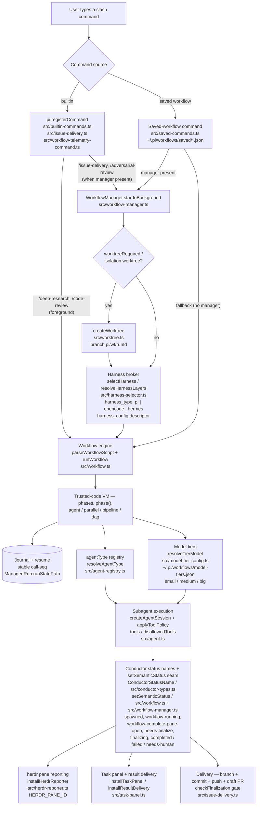

# Architecture — pi-dynamic-workflows

> **Status:** Reference — describes the end-to-end request lifecycle from slash command through delivery.

Cross-cutting docs (linked from each section below): [Context modes](context-modes.md), [Repo-harness bootstrapping](repo-harness-bootstrapping.md), [herdr integration](herdr-integration.md), [Deterministic gated authority](deterministic-gated-authority.md). See also the README "How it works" section for a user-facing summary.

## System diagram

## Component walk-through

### 1. Slash-command dispatch

The entry point is a user typing a slash command in the Pi TUI. Commands fall into two categories that both funnel into the same `WorkflowManager`:

- **Builtin commands** — registered via `pi.registerCommand` in `src/builtin-commands.ts`. This covers bundled workflows like `/deep-research`, `/adversarial-review`, `/code-review`, and `/issue-delivery`; `/issue-delivery`'s workflow script lives in `src/issue-delivery.ts` while its `pi.registerCommand` call lives in `src/builtin-commands.ts` (alongside the others). Only `/workflow-telemetry-report` registers from a separate file (`src/workflow-telemetry-command.ts`). Each builtin command constructs its workflow script inline; routing to the manager vs. inline `runWorkflow()` is per-command (see the dispatch note below).
- **Saved-workflow commands** — defined as JSON files under `~/.pi/workflows/saved/*.json` and registered at extension load by `src/saved-commands.ts`. `registerSavedWorkflow()` creates a `pi.registerCommand` wrapper that parses the `key=value` argument syntax, resolves tool policy for review-vs-mutation workflows, and hands off to the same `WorkflowManager` when present (else inline `runWorkflow()`).

The two paths do not all converge on one entry point — builtins split by command, and saved workflows share the same split as `/issue-delivery`:

- `/deep-research` and `/code-review` run **foreground** via `runWorkflow()` directly (`src/builtin-commands.ts`); they never go through the manager and return their result inline to the TUI.
- `/adversarial-review` and `/issue-delivery` (and its `/fugu` alias) go through `WorkflowManager.startInBackground()` when a manager is available, and fall back to inline `runWorkflow()` otherwise. `/issue-delivery` passes unrecognized tokens to `buildIssueDeliveryArgs()` rather than interpreting a `--foreground` flag (no such flag exists).
- Saved-workflow commands (`src/saved-commands.ts`) likewise prefer `startInBackground()` when a manager is provided, falling back to inline `runWorkflow()` (foreground, no TUI tracking).

(`WorkflowManager.runSync()` exists as an internal/programmatic entry point for inline tool runs; no shipped command handler selects it via a CLI flag.)

### 2. Worktree isolation

Before the harness is selected, the manager evaluates whether the run requires a throwaway git worktree. Three run-level signals trigger isolation (a per-agent `agentOptions.isolation === "worktree"` is separate and handled later inside `runWorkflow()`, see below):

- `isolation.worktree` — a run-level flag on the manager's `ExecOptions`. (Per-agent `agentOptions.isolation === "worktree"` is a separate signal handled later inside `runWorkflow()` at `src/workflow.ts:1403-1407` and is best-effort: it only logs if worktree creation fails, unlike the fail-closed, resumable run-level path.)
- `worktreeRequired` — a run-level flag. The `/issue-delivery` command handler does **not** set it: it passes only `contextMode`, `harness_type`, and `harness_config` to `startInBackground()` (`src/builtin-commands.ts`). Run-level worktree isolation for Issue Delivery, when it occurs, comes from the `harness_config` descriptor's `worktreeRequired` (resolved by the manager, see §3). Separately, the Issue Delivery workflow script (`src/issue-delivery.ts`) computes a `WORKTREE_REQUIRED` value for prototype lanes and passes it to the in-workflow `prototypeSafetyCheck()` gate, which verifies the run is in a clean worktree before allowing prototype execution — that is a safety gate, not the manager's run-level isolation.
- `harness_config` descriptor — if the harness descriptor (looked up from the `harness_config` registry key) sets `worktreeRequired: true`, the run auto-isolates.

When any signal is true, `createWorktree()` in `src/worktree.ts` creates a branch `pi/wf/<runId>` under `<repoRoot>/.pi/worktrees/<slug>`. The `runId` is used (not wall-clock time) so that the worktree name is deterministic and resume can locate it. The `Worktree` object carries `isolated`, `cwd`, `branch`, and `repoRoot` — when isolation cannot be created, it returns a no-op with `isolated: false` and a `reason` string.

### 3. Harness broker

The harness layer determines which coding-agent runtime the workflow subagents use. `src/harness-selector.ts` provides:

- `selectHarness()` — picks the harness type (`pi`, `opencode`, or `hermes`) from the explicit `harness_type` flag, the `harness_config` descriptor, or the runtime default (auto-selection skips `invalid` descriptors, `src/harness-selector.ts`). These three types are the canonical `HARNESS_TYPES` constant in `src/harness-config.ts`.
- `resolveHarnessLayers()` — folds override layers (`harness_type`/`harness_config`) by precedence only (`src/harness-config.ts`); it does **not** validate skipped or invalid descriptors. Skipped/invalid handling lives in the descriptor loader and `expandHarnessConfig()` (`src/harness-config.ts`), and an explicit `--harness-config` that resolves to a skipped or not-wired descriptor is clean-skipped in the manager/runWorkflow path (see the `descriptorUsable`/`descriptorRequiresWorktree` logic in §2 and `src/workflow-manager.ts`).

A `harness_config` descriptor is a named configuration (registered in `src/harness-config.ts`) that bundles a `harness_type`, optional tool policy, and optional `worktreeRequired` flag. When `harness_config` is supplied on the command line, the manager looks up the descriptor and applies its settings. See [repo-harness-bootstrapping.md](repo-harness-bootstrapping.md) for the full bootstrapping and registry mechanics.

### 4. Workflow engine

`src/workflow.ts` contains the trusted-code VM:

- `parseWorkflowScript(script)` — parses the JavaScript string into a `meta` object (name, description, phases) and the executable `body`. The script must export `const meta = { name, description }` as its first statement.
- `runWorkflow()` — executes the body inside a restricted VM. Globals exposed to the script include: `phase()`, `phase(title)`, `agent()`, `parallel()`, `pipeline()`, `dag()`, `log()`, `args`, and `budget`. Nondeterministic globals (`Date.now`, `Math.random`, `setTimeout`, `require`) are intentionally blocked.

The four scheduling primitives are:

| Primitive | Purpose |
|-----------|---------|
| `agent(prompt, opts)` | Spawn a single subagent with optional `tier`, `model`, `tools`, `disallowedTools`, `agentType`, `contextMode`, `compactionPolicy`. |
| `parallel(fn[])` | Run independent agents simultaneously (takes functions, not promises). |
| `pipeline(items, ...stages)` | Pass each item through sequential transformation stages. |
| `dag(nodes)` | Execute dependency-ordered waves; failed nodes cascade-skip dependents. |

#### Journal and resume

Each `agent()` call is assigned a stable call index (deterministic call-sequence number). The `JournalEntry` stores the call index, prompt hash, options hash, and the result. When a run is resumed, unchanged entries are replayed from the journal (`resumeJournal`), so only the changed suffix re-executes. The persisted run-state JSON lives at `runsDir/<runId>.json`, referenced by `ManagedRun.runStatePath`.

> **Note:** The step specification references `ManagedRun.runStatePath` — this is the `runStatePath` property on the `ManagedRun` interface, which stores the absolute path to the `<runId>.json` file in the `runsDir`.

### 5. agentType registry

`src/agent-registry.ts` hosts the agent-type system:

- `loadAgentRegistry()` — loads agent-type definitions by scanning project (`.pi/agents/`-equivalent) and user (`~/.pi/agents/`) directories for `.md` files. No defaults are shipped in the extension source; names like `adversarial-evidence-reviewer`, `code-scout`, `specialized-worker`, and `trace-analyst` are runtime-installed definitions, not built-ins.
- `resolveAgentType(name, registry)` — returns the `AgentDefinition` (role prompt, tool policy, model hints) for a named agent type.
- `applyToolPolicy()` — merges explicit `tools`/`disallowedTools` with the agentType's policy and read-only fences.

When an `agent()` call specifies `agentType: 'specialized-worker'`, the registry injects the role prompt and tool restrictions without the workflow script needing to repeat them.

### 6. Model tiers

`src/model-tier-config.ts` implements tier-based model routing:

- `resolveTierModel(tier, config)` — resolves a tier name (`small`, `medium`, `big`) to one concrete `provider/model` string from the local `~/.pi/workflows/model-tiers.json` file.
- Resolution precedence is explicit `opts.model` → agentType model → tier → phase model → untagged `medium` → session model.
- The tier config is snapshotted once per run. The concrete routed model is included in each journal hash, so changing the model behind a tier invalidates the affected resume suffix.
- Optional `routingNotes` are added to the model-facing workflow authoring guidance for operator-specific specialization.

There are no per-tier fallback chains and retries do not escalate automatically. Workflow scripts must encode route changes explicitly. This keeps source portable while letting each machine choose its own cost/capability profile. See [Model routing and specialization](model-routing-specialization.md).

### 7. Subagent execution

The actual subagent spawn lives in `src/agent.ts`:

1. **Session creation** — `createAgentSession()` (from the Pi SDK) creates the Pi session for the subagent with the resolved model, harness, tool set, and context mode.
2. **Tool policy** — `applyToolPolicy()` from the agent registry merges the final tool list, applying read-only restrictions when `readOnly: true` or the agentType mandates it.
3. **Context mode** — governed by `contextMode` (valid modes: `focused` default, `isolated`, `scoped`, `legacy`). `replace` is a `systemPromptMode` value on a mode, not a context mode itself. See [context-modes.md](context-modes.md) for how the four prompt channels are assembled.
4. **Transcript persistence** — when `persistSubagentTranscripts` is enabled (default), each subagent writes an NDJSON transcript to `transcriptDir` for post-mortem debugging.

### 8. Conductor status lifecycle

`src/conductor-types.ts` defines the conductor lifecycle as `ConductorStatusName`:

| Status | Category |
|--------|----------|
| `spawned` | Active |
| `workflow-running` | Active |
| `workflow-complete-pane-open` | Active |
| `needs-finalize` | Attention |
| `finalizing` | Active |
| `completed` | Terminal |
| `failed` | Terminal |
| `needs-human` | Attention |

The workflow engine sets status via `setSemanticStatus()` (injected into the workflow script globals). The status is stored in `ManagedRun.semanticStatus` and surfaced to the herdr pane, task panel, and `/workflows status <runId>`.

### 9. herdr pane reporting

`src/herdr-reporter.ts` provides `installHerdrReporter()`:

- Feature-detected: installs a no-op when `HERDR_PANE_ID` is not set in the environment, so the extension runs safely outside herdr.
- When active, streams `ConductorStatusName` transitions to the herdr pane so the operator sees real-time workflow status in the conductor UI.
- See [herdr-integration.md](herdr-integration.md) for the full herdr lifecycle and reconciliation.

### 10. Task panel and result delivery

`src/task-panel.ts` provides two installations:

- `installTaskPanel()` — creates the workflow task panel UI that shows running/background runs.
- `installResultDelivery()` — wires up the notification system so background workflow results are delivered back into the conversation as task notifications. Foreground (sync) runs return the result inline and do not trigger duplicate delivery.

### 11. Draft-PR delivery and `checkFinalization` gate

Issue Delivery (`src/issue-delivery.ts`) is the only workflow that performs delivery:

1. After the Worker subagent completes and the Verifier passes, the workflow generates a branch, commits, pushes, and opens a draft PR.
2. `checkFinalization()` runs a deterministic gate that verifies:
   - The worktree is on a clean committed-and-pushed state.
   - All dirty paths are intentional. The gate ignores only the transient `.issue-delivery/` prefix (`TRANSIENT_IGNORE_PREFIXES` in `src/conductor-finalization.ts`); legacy `.fugu/` is retired and **not** ignored, so a worktree still containing it blocks finalization until cleaned.
   - Pending CI checks are not in a failing state.

   The gate does **not** verify GitHub mergeability (e.g. merge-conflict state); a PR with merge conflicts is not rejected by `checkFinalization()`.
3. If the gate passes, the status transitions to `completed`. If it fails, the status becomes `needs-human` with a suggested `nextAction` and the handoff artifact is written.

The `--finish` flag is a delivery path for an already-repaired failed run: it runs LocalChecks, then a Worker delivery agent that commits/pushes/opens the draft PR, then the finalization gate — it does not re-run Scout/Thinker/Verifier planning. The `--prototype` flag runs a bounded dry-run that stops before PR creation.

---

*This doc cross-links to [README "How it works"](../README.md#how-it-works) for the user-facing overview, and to the component-specific docs: [context-modes.md](context-modes.md), [repo-harness-bootstrapping.md](repo-harness-bootstrapping.md), [herdr-integration.md](herdr-integration.md), [deterministic-gated-authority.md](deterministic-gated-authority.md).*
