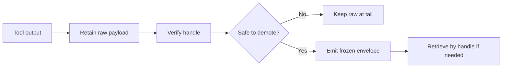

## Executive verdict

  

15

Findings survived

  

0

Findings discarded

  

1

Blocking uncertainty

<strong>Bottom line:</strong> the CWC architecture is sound enough to implement.

<strong>Guardrail:</strong> arrival demotion must own <code>persist → verify → replace</code>. Do not assume the runtime already retained byte-exact tool output.

---

## What the findings validate

### Cache economics

- Prefix caches are sensitive to the first changed token
- Tail appends are cheap
- Middle rewrites must be batched
- Anthropic cache fields make this measurable

### Data safety

- Manifest stores pointers, not payloads
- Hindsight recall is not byte-exact retrieval
- Sidecar remains prudent until handles are proven
- Summaries must replay byte-identically

<strong>Design implication:</strong> reduce live prefix size early, but only through cache-safe surfaces.

---

## The one unresolved premise

<strong>Unproven:</strong> every tool output is synchronously retained with a usable handle before arrival-plane rewriting.

### Required implementation contract

1. Capture raw tool output
2. Retain raw payload to Hindsight or sidecar
3. Verify the handle resolves byte-exactly
4. Only then emit the envelope or stub
5. If any step fails, keep the raw output live

<pre><code>raw output → retain → verify → replace
            no verify → no replace</code></pre>

---

## Runtime risks to probe first

| Area | Risk | Required behavior |
| --- | --- | --- |
| Claude Code hooks | <code>updatedToolOutput</code> may be ignored for some tools/versions | Version-gate and fail closed |
| Tool failures | Failure path may not honor replacement | Test <code>PostToolUseFailure</code> behavior |
| Hindsight wrapper | Existing wrapper may only expose <code>retain</code>/<code>recall</code> | Add get-by-handle or sidecar |
| LiteLLM | Proxy layer does not own canonical history | Do not use as curation layer |

---

## What CWC should store

### Manifest: hot index only

- Span identity and session ownership
- Sequence position and span type
- Hindsight ref and optional blob hash
- Raw/live token counts
- State: live or demoted
- Frozen summary envelope
- Safety flags: pinned, load-bearing, recent, active edit
- Access/demotion metadata for tuning

<strong>Never store raw tool or file payloads in the manifest.</strong>

---

## The safe operating model

---

## Implementation stance

| Phase | Build | Ship rule |
| --- | --- | --- |
| 1 | Manifest + arrival plane | Fail closed to raw output |
| 2 | Batched curation plane | One thresholded cache break only |
| 3 | Retrieve / recall + tuning | Tune toward low, nonzero refetch rate |

<strong>Start narrow:</strong> Phase 1 gives immediate token savings with minimal cache risk.

---

## Safety rules that become tests

- No per-turn middle edits
- Stable zone is immutable except scheduled summary-anchor updates
- Recent-K, pinned, load-bearing, open-task, and active-edit spans are never demoted
- Demoted summaries are generated once and replayed byte-for-byte
- Missing handle or blob means no demotion
- Re-fetched content returns at the tail

---

## Next actions

  

1

Probe hook matrix

  

2

Verify byte-exact retrieval

  

3

Implement Phase 1

### Decision

Proceed with CWC, but treat arrival retention as CWC-owned until the target runtime proves otherwise.
